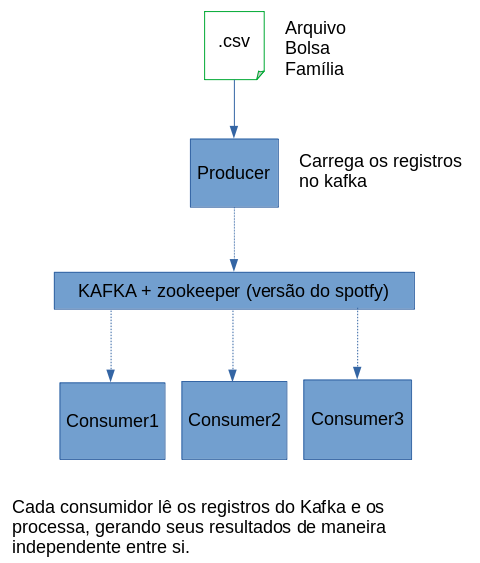

# Atividade de Integration Tools - 34SCJ

Crie um produtor para carregar os dados do arquivo do bolsa família (referente ao período de janeiro/2019) para um Topic no Kafka e implemente 3 consumidores que irão nos ajudar a responder algumas perguntas.

  - Exibir [UF] + [somar da parcela] + [qtd de beneficiários] até o momento
  - Mostrar dados do beneficiário que tenha a maior parcela até o momento
  - Quantidade de registros lidos do Topic

##### Big Picture da solução:



# Para executar

  - Executar o docker-compose up
  - Executar o get em localhost:8080 para carregar os registros no tópico csv_topic
  - Observar o log do container consumer1, ficará ativo por 30s para consumir as mensagens e mostrar o cálculo.
  - Observar o log do container consumer3, após o período de 35 segundos consumindo as mensagens, ele mostrará o resultado em uma mensagem semelhante à: "Temos um total de ### beneficiários lidos no arquivo CSV."


Membros do Grupo:
  - Caio Souza Norbiato (RM333950)
  - Heuler Alexandre Vila (RM333943)
  - Rafael Petronilio (RM334076)
  - Bruno Shiroma (RM334070)


### Tech

Links

* [Trello](https://trello.com/b/r84eF4pp/trabalho-integra%C3%A7%C3%A3o) - Link para o trello


### Installation

Para executar o projeto

```sh
$ docker-compose up
```

### Prints de resultados
##### Resultado do consumer 1:

##### Resultado do consumer 2:

##### Resultado do consumer 3:

##### Atividades relializadas no Trello:

 
